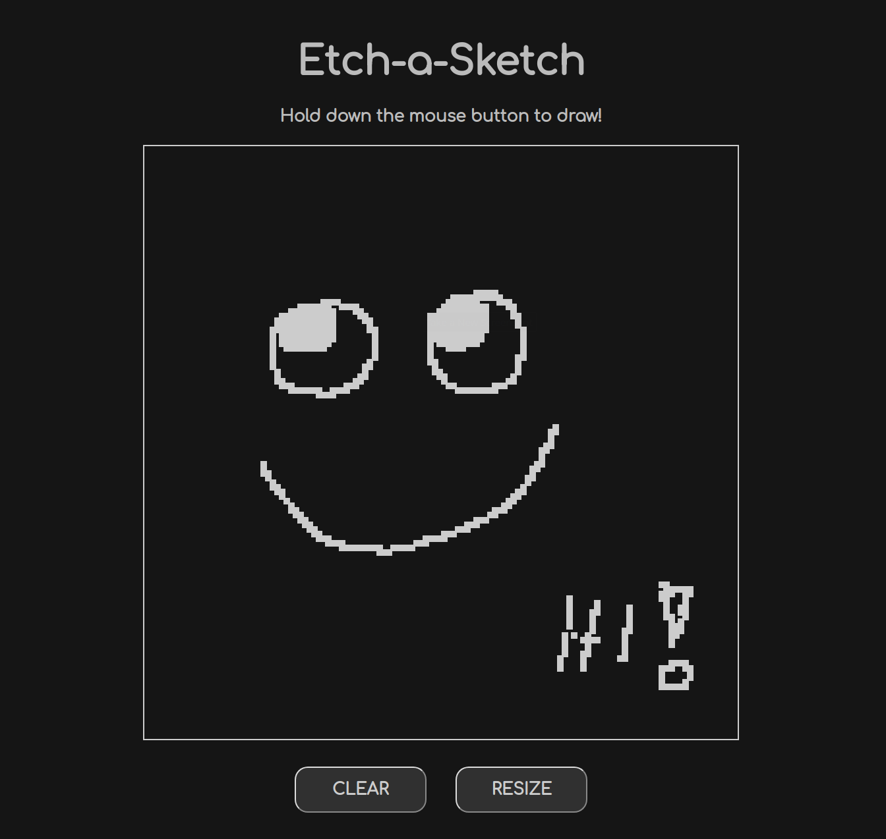

# etch-a-sketch

An exercise from The Odin Project made to bring knowledge of HTML, CSS and JS together.

Hold down the left mouse button to draw, press "Clear" to start over and "Resize" to change the resolution of your canvas.

<a href="https://hermesjpappas.github.io/etch-a-sketch/" target="_blank">Try it out!</a>

This was a nice little project that taught me a lot about the interactions between HTML, CSS and JS.
I added some extra functionality to it, like the choice to hold down the mouse button in order to draw, a separation of the "clear" function from the function that changes the number of pixels in the grid (didn't want to annoy the user with a resize prompt if they only wanted to clear the canvas) and a little bit of text on the upper left that displays the current size of the grid so the user knows what resolution they are working with. 
